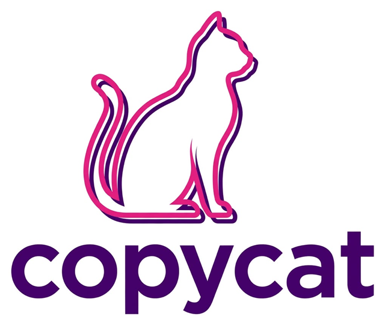

# 🐱 Copycat · Impresiones y Copias

PWA para administrar un negocio pequeño de impresiones y copias, pensada para que la use un adolescente: botones grandes, lenguaje sencillo y la app hace las cuentas.

**Funciona sin internet.** Los datos se guardan solo en el dispositivo (IndexedDB), sin servidor ni nube.

## Qué hace

| Sección | Para qué sirve |
|---|---|
| 🛒 **Vender** | Tocar productos para armar el carrito, cambiar cantidades (ej. 37 copias) y usar "Otro cobro" para lo que no está en la lista. |
| 💵 **Cobrar** | Escribes o tocas los billetes que te dio el cliente (se suman) y la app dice **cuánto cambio dar y con qué billetes y monedas**. |
| 📒 **Fiado** | Fiar una venta a un cliente, ver quién debe y cuánto, registrar pagos (también calcula el cambio) y mandar un recordatorio por WhatsApp. Tiene un límite de deuda por cliente. |
| 📦 **Inventario** | Precio, costo, ganancia y existencias de cada cosa. Los servicios pueden gastar inventario (cada copia descuenta 1 hoja). Avisa cuando algo se está acabando. 📥 = llegó mercancía. |
| 💼 **Dinero** | Cuánto se ha **invertido**, cuánto ya se **recuperó** y cuánto falta, y dónde está la inversión (sobre, mercancía, equipo). El dinero cobrado se separa en dos **sobres**: 🟪 *Inversión* (lo que costó lo vendido, para recuperar y volver a surtir) y 💗 *Ganancia*. Se registran inversiones, compras (tóner, mercancía) y retiros, incluido regresarle la inversión a quien la puso. |
| 🧮 **Precios** | Tres calculadoras: *¿a cuánto lo vendo?* (según lo que pagaste y cuánto quieres ganar), *precio de una copia* (hoja + tóner + luz) y *¿cuánto gano?*. Redondea el precio hacia arriba para que sea fácil dar cambio. |
| 📊 **Mi día** | Lo vendido, la ganancia, el efectivo, los fiados, lo más vendido, los últimos 7 días, la lista de ventas (con opción de cancelar) y exportar a Excel. |
| 🌙 **Cerrar el día** | Cuentas el dinero de la caja y la app dice si cuadra, si sobra o si falta, y **cuánto meter en cada sobre** (lo que falta o sobra se ajusta en la ganancia). Al cerrar **se guarda el respaldo**. |

## Respaldos al final del día

1. **Al cerrar el día** se guarda un archivo `respaldo-copias-AAAA-MM-DD.json`:
   - En computadora con Chrome o Edge puedes elegir una **carpeta** en ⚙️ Ajustes y los respaldos se guardan ahí automáticamente (por ejemplo, una carpeta de OneDrive para que también queden en la nube).
   - En el teléfono se descarga en *Descargas* y aparece el botón **📤 Mandar respaldo a mamá/papá** (WhatsApp, Drive, correo…).
2. **Aviso a la hora de cierre** (por defecto a las 19:00, se cambia en Ajustes): sale una franja y un aviso para cerrar el día.
3. **Si se olvida cerrar el día**, al abrir la app al día siguiente el día anterior se cierra solo, se guarda un respaldo interno y la app pide guardar el archivo.
4. **Respaldos internos automáticos**: uno cada día al abrir la app y otro en cada cierre (se guardan los últimos 30). Se restauran desde ⚙️ Ajustes.

> Un navegador no puede guardar archivos en el dispositivo con la app cerrada; por eso el respaldo se hace al cerrar el día (o al día siguiente, si se olvidó).

## 🔒 PIN de adulto (opcional)

En ⚙️ Ajustes. Si lo activas, la app pide el PIN para: crear, editar o borrar productos y precios, cancelar ventas, fiar más del límite, borrar clientes, restaurar respaldos y borrar todo. Vender, cobrar, recibir pagos y sumar mercancía no lo piden.

## Cómo publicarla o probarla

Necesita servirse por `http://localhost` o `https://` (con `file://` no funciona el modo sin internet).

- **Probar en la computadora:** desde la carpeta de arriba, `npx http-server copias-negocio -p 5195 -c-1` y abrir http://localhost:5195
- **Publicar gratis:** sube la carpeta a GitHub Pages, Netlify o Cloudflare Pages. Abre la URL en el teléfono o la tablet y elige **"Agregar a la pantalla de inicio" / "Instalar app"**. A partir de ahí funciona sin internet.

## Archivos

- `index.html`, `styles.css`, `app.js`: la app (JavaScript puro, sin compilación)
- `sw.js`: service worker (guarda la app para usarla sin internet)
- `version.js`: versión; súbela en cada cambio para que los dispositivos descarguen la nueva
- `manifest.webmanifest`, `icons/`: instalación como app. `icons/logo-original.png` es el logo original de Copycat; de él salen `logo.png` (bienvenida y ayuda), `gato.png` (barra superior) e `icon-192/512.png` (ícono de la app).
- Colores de la marca: morado `#3B055D` y rosa `#E0267F`.
